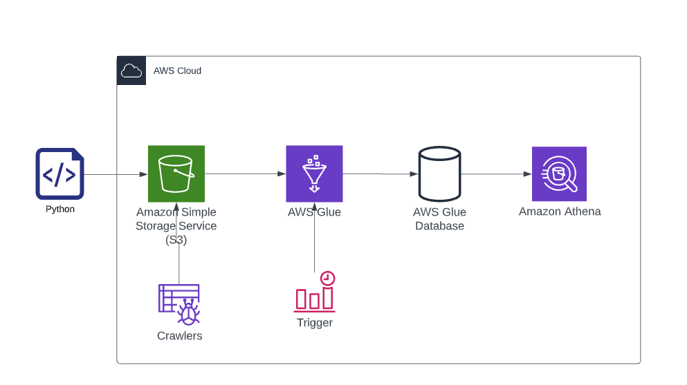

# Data engineering challenge Jobsity

This repository ingests a .csv file, does some transformations and loads the data into a database.

The idea of ​​the project is to keep the entire process within AWS, having AWS S3 as the source, AWS Glue to make some ETLs and AWS Athena for consume the data.

In order to handle 100 million entries the project was structured using terraform so that the architecture can be versioned and easily scaled through code.

The main changes made were: 
- Converting the files to parquet so that the data can be consumed more efficiently.
- Creating a column with the timestamp of the moment the pipeline runs so that we can identify if the process has any errors.

Views in AWS Athena were created to answer the questions.

## Requirementes

```bash
python - version 3.8
aws cli
terraform
AWSAccessKeyId / AWSSecretKey
```

## Installation

First you need configure your aws cli, use the keys that were sent

```bash
aws configure
```
Deploy the application in AWS

```bash
terraform init
terraform plan
terraform apply
```

## Created Infrastructure

    - One Bucket
    - One Glue-Crawler
    - One Glue-Database
    - One Glue-job with a pyspark script


## Usage

On AWS Console start the crawler once.

The others services will run automatic when the trigger start.

Run in Athena the 3 SQL files that are in the directory /SQL

## Infrastructure details



AWS Glue will read the .csv file in S3 and use a pyspark script (/spark.py) to convert csv to parquet and a add a new column timestamp with the moment that the job run.

A trigger will start the Glue-job automatic onde a week (trigger is now disabled for cost reasons)

Glue-crawler will create the tables in the database, so the data can be consumed by Athena
